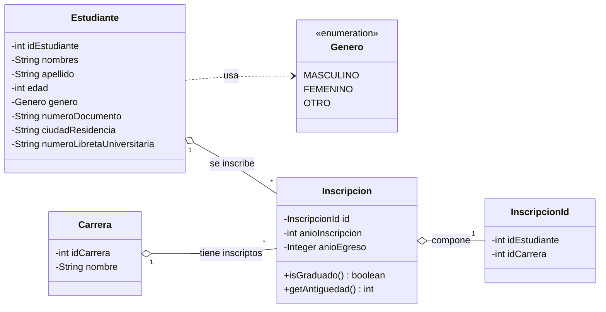
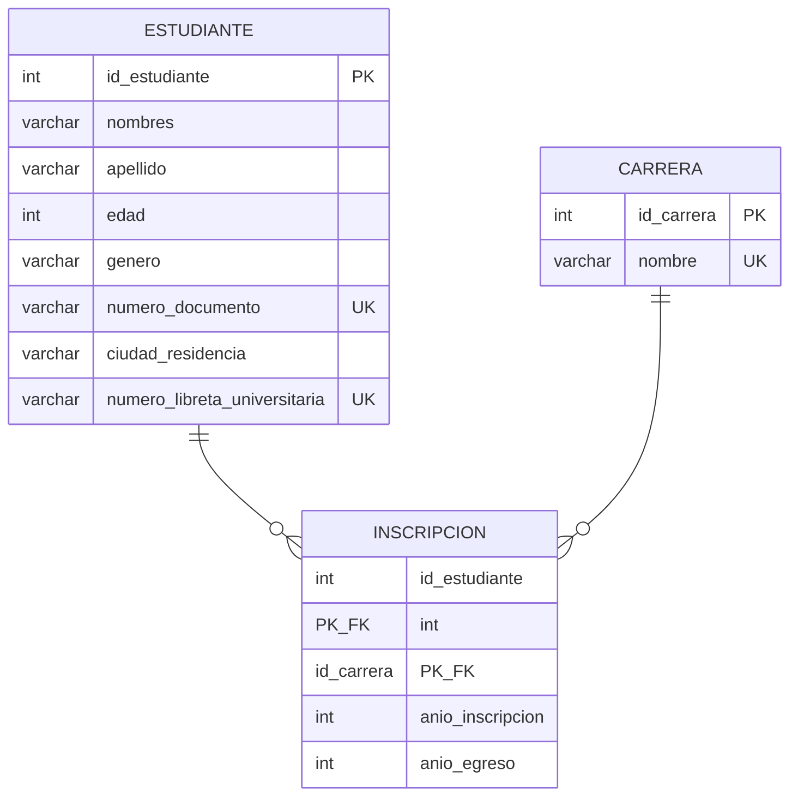

# Ejercicio Integrador — Punto 1: Diseño del modelo de dominio

Modelo de un registro de estudiantes con inscripciones a carreras, implementado
como entidades JPA en `src/main/java/entities/`.

## Diagrama de objetos (UML)

La relacion muchos-a-muchos entre `Estudiante` y `Carrera` se resuelve con una
clase de asociacion `Inscripcion`, que porta los atributos propios de cada
inscripcion (`anioInscripcion`, `anioEgreso`).



## Diagrama DER



## Correspondencia entidad - tabla

| Clase JPA | Paquete | Tabla | Clave primaria | Observaciones |
|---|---|---|---|---|
| `Estudiante` | `entities` | `estudiante` | `id_estudiante` (asignada) | `numero_documento` y `numero_libreta_universitaria` son unicas |
| `Carrera` | `entities` | `carrera` | `id_carrera` (asignada) | `nombre` unico |
| `Inscripcion` | `entities` | `inscripcion` | compuesta `(id_estudiante, id_carrera)` → `InscripcionId` | FK a `estudiante` y `carrera` |

## Decisiones de diseño

- **Relacion M:N con clase de asociacion**: `Estudiante` y `Carrera` se conectan
  a traves de `Inscripcion` (entidad con `@EmbeddedId`), porque cada inscripcion
  necesita atributos propios: `anioInscripcion`, `anioEgreso` y la `antiguedad`
  derivada.
- **Identificadores asignados**: los ids no usan autoincremento; se mantienen los
  ids numericos que vienen en los CSV del dataset (`estudiantes.csv`,
  `carreras.csv`, `estudianteCarrera.csv`). Por eso `estudianteCarrera.csv` puede
  referenciar filas por id.
- **`anioEgreso` nulo = no graduado**: en lugar de un booleano, el egreso se modela
  con el anio (`Integer` nullable). Esto habilita la consulta del punto 3
  ("egresados por ano") del reporte. `isGraduado()` devuelve `anioEgreso != null`.
- **`antiguedad` derivada**: `anioActual - anioInscripcion`, no se persiste como
  campo propio.
- **Genero como enum**: `MASCULINO`, `FEMENINO`, `OTRO`, persistido como string
  (`@Enumerated(EnumType.STRING)`).

## Base de datos (Docker)

El entorno objetivo usa **MySQL 8 oficial en Docker**

- Levantar la base (desde la raiz del proyecto):

  ```bash
  docker compose up -d
  ```

- La imagen `mysql:8.0` crea automaticamente la base `arquisegundaentrega`
  (variable `MYSQL_DATABASE`).
- Credenciales: `root` / `password` — coinciden con `persistence.xml`.
- `persistence.xml`: